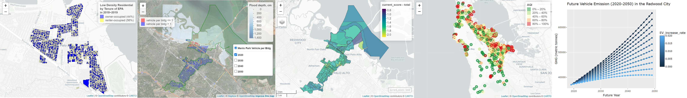
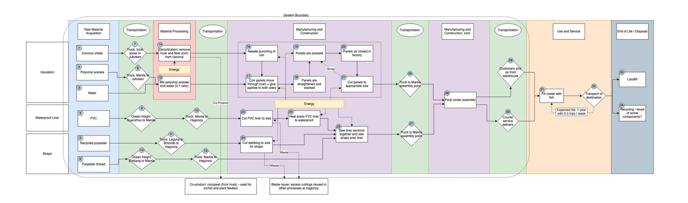

<style>
body {
text-align: justify}
</style>

```{r setup, include=FALSE}
knitr::opts_chunk$set(echo = TRUE, warning = F, message = F)
```

```{=html}

```

## About

I am Jinpu Cao, a graduate student in the [Sustainable Design and Construction Program](https://cee.stanford.edu/academics-admission/graduate-degrees/ms-programs/sustainable-design-construction-sdc) of the Civil and Environmental Engineering Department at Stanford University (2020 - 2022). My research interests lie in applying data-driven methods and Artificial Intelligence (AI) to Architecture Engineering and Construction (AEC) to help us create smart and sustainable infrastructures and living environments.

## Education Experience

-   2020 - 2022 M.S. in [Sustainable Design and Construction Program](https://cee.stanford.edu/academics-admission/graduate-degrees/ms-programs/sustainable-design-construction-sdc) 

    *Civil and Environmental Engineering Department, Stanford University*		
				
-   2019 - 2020 Exchange Student in [GeoSystems Engineering Program](https://ce.berkeley.edu/programs/geo)
  
    *Civil and Environmental Engineering Department, University of California, Berkeley*
				
-   2016 – 2019 B.E. in [Geotechnical Engineering Department](https://geotec.tongji.edu.cn/geotec_en/main.htm)

    *Civil Engineering College, Tongji University*

## Conferences

1.  {align="right" margin="50" width="180"}Speaker in the 4th International Conference on Information Technology in Geo-Engineering ([4ICITG](https://www.4iticg.org/4-august-2022))

    The conference was organized by Geotechnical Society of Singapore in August 2022.

    Presentation: "***[A Long-term Probabilistic Forecasting Approach of TBM Operating Parameters based on Deep Learning](https://github.com/J-i-n-p-u/Long-term-Probabilistic-Forecasting-of-TBM-Operating-Parameters#long-term-probabilistic-forecasting-of-tbm-operating-parameters)***"  ([video](https://drive.google.com/file/d/120fCDxok1N5_AgnAPHnvCo-gy0Vtct6B/view?usp=sharing), [slides](https://github.com/J-i-n-p-u/Long-term-Probabilistic-Forecasting-of-TBM-Operating-Parameters/blob/main/A%20Long-term%20Probabilistic%20Forecasting%20Approach%20of%20TBM%20Operating%20Parameters%20based%20on%20Deep%20Learning.pdf), [code](https://github.com/J-i-n-p-u/Long-term-Probabilistic-Forecasting-of-TBM-Operating-Parameters/tree/main/Probabilistic%20Forecasting%20Model))

2.  Speaker in the [II International Geo-science Machine Learning Big Data Seminar](http://ismlg-lille2020.com/wp-content/uploads/2019/12/2nd-MLBig-Data-workshop-Program.pdf).

    Hosted by ISSMGE Technical Committee of Machine Learning and Big Data (TC309) Risk and Insurance Research Branch of China Civil Engineering Society in July 2019, Shanghai.

    Presentation: "***Predicting TBM Performance using Machine Learning: is Surrounding Rock Information Important.***"

## Publications

1.  [An LSTM-based model for TBM performance prediction and the effect of rock mass grade on prediction accuracy](https://github.com/J-i-n-p-u/TBM-performance-prediction-and-rock-mass-grade) (China Civil Engineering Journal, first author, accepted)

2.  [PigSense: Vibration-based Activity and Health Monitoring System for Pigs](https://github.com/J-i-n-p-u/Characterization-of-the-piglet-group-activities-with-structural-vibration#characterization-of-the-piglet-group-activities-with-structural-vibration) (ACM Journals, co-author, in review)

3.  Improving adaptation to wildfire smoke and extreme heat in vulnerable communities: Evidence from a pilot study in the San Francisco Bay Area (Environmental Research Letters, contributor, ready to submit)

## Research Projects

1.  [**Computer Vision-based Pavement Distress Detection System**](https://github.com/J-i-n-p-u/Pavement-Crack-Detection-based-on-Computer-Vision#pavement-crack-detection-based-on-computer-vision) (March 2022 - Now, Stanford University)
  
    {align="right" margin="50" width="180"}

    <p align='left'>Key Words: Computer Vision, Crack Detection, Web Development, Business Value, Deep Learning     [*(Python, TensorFlow, [Dash](https://dash.plotly.com/introduction))*]{style="color:green"}</p>
    
    Worked as a research assistant advised by Pooja Jain (V.P. Strategic Innovation in WSP) and [Dr. Martin Fischer](https://profiles.stanford.edu/martin-fischer) (Professor at Stanford).

    This is a significant exploration of developing the practical workflow of an end-to-end vision-based automatic pavement distress detection system ([demonstration video](https://github.com/J-i-n-p-u/Pavement-Crack-Detection-based-on-Computer-Vision#run-the-train-model-application)). Also, I am responsible for figuring out its potential business value.

2.  **[Pilot Air Quality Analysis in the Bay Area](https://github.com/J-i-n-p-u/Pilot-Air-Quality-Analysis-in-the-Bay-Area#pilot-air-quality-analysis-in-the-bay-area)** (March 2022 - Now, Stanford University)\

    <p align='left'>Key Words: Data Manipulation, Time Series Decomposition, Clustering, Regressive Analysis, Community-engaged    [*(R)*]{style="color:green"}</p>

    {align="left" margin="50" width="215"} Worked as a research assistant advised by [Derek Ouyang](https://derekouyang.com/) (Research Manager at the [RegLab, Stanford](https://reglab.stanford.edu/)) and [Dr. Gabrielle Wong-Parodi](https://profiles.stanford.edu/209361) (Professor at Stanford).

    This community-engaged pilot study aims to improve adaptation to wildfire smoke and extreme heat in vulnerable communities. I am responsible for characterizing these communities' air quality and exploring their human-induced and environment-induced influence. Our team characterized the relationship between indoor and outdoor air quality with a "spike lag" model and verified it with actual monitoring data. ([Pilot Report](https://github.com/J-i-n-p-u/Pilot-Air-Quality-Analysis-in-the-Bay-Area/blob/main/Hazards%20Within%20Our%20Homes%20An%20Analysis%20of%20Indoor%20Air%20Pollution%20In%20the%20Bay%20Area%20In%20Partnership%20With%20OCOB.pdf))

3.  **[PigSense: Structural Vibration-based Activity and Health Monitoring System for Pigs](https://github.com/J-i-n-p-u/Characterization-of-the-piglet-group-activities-with-structural-vibration#characterization-of-the-piglet-group-activities-with-structural-vibration)** (Jan 2022 - Sept 2022, Stanford University)\

    Key Words: Signal Processing, Classification, Machine Learning     [*(MATLAB, Python, scikit-learn)*]{style="color:green"}

    {align="right" margin="50" width="170"} Worked as a research volunteer advised by [Dr. Hae Young Noh](https://profiles.stanford.edu/hae-young-noh?releaseVersion=9.11.0) (Professor at Stanford) in Stanford [Structures as Sensors Lab](https://noh-lab.stanford.edu/)

    The project introduced the first system-PigSense to use structural vibration to track animals. The system uses physical knowledge of the structural vibration characteristics caused by pig-activity-induced load changes to recognize different behaviors of the sow and piglets. I am responsible for applying machine learning to automate the characterization of the piglet group activities, including nursing, sleeping, and being active base on vibration data. 

4.  [**Sustainable Urban System Projects**](https://github.com/J-i-n-p-u/Sustainable-Urban-System#sustainable-urban-systems) (Sept 2021 - June 2022, Stanford University)\

    Key Words: Data Manipulation and Visualization, Geospatial Data, Census Data, Equity analysis, Monte Carlo simulations, Regression, Causality Analysis, Web Application     [*(R, [Shiny](https://shiny.rstudio.com/))*]{style="color:green"}

    The Sustainable Urban Systems (Stanford CEE 218, [Shaping the Future of the Bay Area](http://bay.stanford.edu/), advised by [Derek Ouyang](https://derekouyang.com/) and [Dr. Jenny Suckale](https://sigma.stanford.edu/)) emphasis merges traditional data analytics with complex systems analysis to better inform decisions around the wicked problems of urban development like urban [land use](https://github.com/J-i-n-p-u/Sustainable-Urban-System#land-use), [hazard analysis](https://github.com/J-i-n-p-u/Sustainable-Urban-System#hazard-analysis), [amenity accessibility](https://j-i-n-p-u.github.io/Sustainable-Urban-System/HTML/Complete_Community.html), [equity implications of air quality](https://j-i-n-p-u.github.io/Sustainable-Urban-System/HTML/Assessment%20of%20the%20Equity%20Implications%20of%20Air%20Quality%20in%20San%20Mateo%20County.html) and [emission analysis](https://j-i-n-p-u.github.io/Sustainable-Urban-System/HTML/Analyze%20Emission%20based%20on%20Routing%20Data.html).

    

5. [**Fortuna Cools Life Cycle Assessment**](https://github.com/J-i-n-p-u/Fortuna-Cools-Life-Cycle-Assessment#fortuna-cools-life-cycle-assessment)\ (Sept 2020 - Jan 2021, Stanford University)

    Key Words: Life Cycle Assessment, Sensitivity Analysis     [*(R, [SimaPro](https://simapro.com/))*]{style="color:green"}

    {align="left" margin="50" width="300"} Fortuna Cools ([Fortuna](https://www.fortunacools.com/)) was founded in 2018 with the goal of creating an affordable and environmentally sustainable option for coolers for fishermen. To date, they have operated in the Philippines, producing coolers made in large part of coconut husk, a common waste product. The coolers are intended as an alternative for expanded polystyrene (EPS) coolers with a usable life of just two weeks, or as alternatives to reusable polyurethane coolers that are often too expensive to be a feasible option for fishermen. Stanford team and Fortuna team worked together and conducted a formal life cycle assessment (Stanford CEE 226: Life Cycle Assessment for Complex Systems, advised by Dr. [Michael Lepech](https://profiles.stanford.edu/michael-lepech)) of Fortuna coolers. We determined that the Fortuna cooler life cycle is associated with drastically lower greenhouse gas emissions and is comparable to or has slightly higher emissions than EPS coolers in several impact categories. The capability of coconut husks to be degraded and converted into a biodegradable compost and fertilizer minimizes the energy requirement towards the end-of-life disposal; the ability to compost the Fortuna cooler provides additional benefit over EPS. ([Poster](https://github.com/J-i-n-p-u/Fortuna-Cools-Life-Cycle-Assessment/blob/main/Poster.pdf), [Report](https://github.com/J-i-n-p-u/Fortuna-Cools-Life-Cycle-Assessment/blob/main/Fortuna%20Cools%20Life%20Cycle%20Assessment%20Report.pdf))
    
6.  **[Battery Lifetime Prediction with Limited Cycle Data](https://github.com/J-i-n-p-u/Battery-Lifetime-Prediction-with-Limited-Cycle-Data#battery-lifetime-prediction-with-limited-cycle-data)** (Sept 2021 - Jan 2022, Stanford University)

    Key Words: Battery Lifetime Prediction, CNN, Bi-LSTM, Confidence Interval     [*(Python, TensorFlow, PyTorch)*]{style="color:green"}.

    {align="right" margin="50" width="215"} Accurately predicting the remaining useful lifetime of batteries is critical for accelerating technological development and creating a paradigm shift in battery usage. Data-driven approaches,based on large datasets, provide a physical-model agnostic way to predict the health status of batteries with high accuracy. However, most datadriven methods on battery life prediction often rely on features extracted from a hundred cycles worth of data for a given cell, making it computationally inefficient and incompatible with on-board application.

    The course project (Stanford CS 329P [Practical Machine Learning](https://c.d2l.ai/stanford-cs329p/), advised by [Dr. Mu Li](https://scholar.google.com/citations?user=Z_WrhK8AAAAJ&hl=en)) applied machine-learning models, including linear regression, random forest regression, convolutional neural networks, and recurrent neural networks to make predictions on cell life. Our best model achieve a 7.5% prediction error given the data of only 5 cycles. ([Report](https://github.com/J-i-n-p-u/Battery-Lifetime-Prediction-with-Limited-Cycle-Data/blob/main/Battery%20Lifetime%20Prediction%20with%20Limited%20Cycle%20Data.pdf), [Slides](https://github.com/J-i-n-p-u/Battery-Lifetime-Prediction-with-Limited-Cycle-Data/blob/main/Battery%20Lifetime%20Prediction.pdf), [Video](https://github.com/J-i-n-p-u/Battery-Lifetime-Prediction-with-Limited-Cycle-Data/blob/main/Battery%20Lifetime%20Prediction.mp4))

7.  **[Long term probability prediction platform of urban water consumption](https://github.com/J-i-n-p-u/Long-term-probability-prediction-platform-of-urban-water-consumption#long-term-probability-prediction-platform-of-urban-water-consumption)** (Oct 2020 - Aug 2021, Tongji University)\

    Key Words: Time Series, Probabilistic Prediction, DeepAR     [*(Python, [GluonTS](https://ts.gluon.ai/stable/))*]{style="color:green"}

    {align="left" margin="50" width="300"} Worked as a research assistant advised by [Dr. Fang Liu](https://geotec.tongji.edu.cn/lf/main.psp) (Professor at Tongji University)

    This was a practical and valuable project to build an intelligent diagnosis, risk reasoning, and decision support system for municipal facilities. I independently developed a water consumption probabilistic prediction model based on the deep autoregressive (DeepAR) algorithm. The model has been integrated into the Shanghai Smart Intelligent Platform to predict daily water consumption and provide plumbing burst alarming services. ([Report](https://github.com/J-i-n-p-u/Long-term-probability-prediction-platform-of-urban-water-consumption/blob/main/Real_time_Water_Consumption_Prediction.pdf), [Slides](https://github.com/J-i-n-p-u/Long-term-probability-prediction-platform-of-urban-water-consumption/blob/main/Real-time%20Water%20Consumption%20Prediction%20Based%20on%20Deep%20Learning.pdf), [Codes](https://github.com/J-i-n-p-u/Long-term-probability-prediction-platform-of-urban-water-consumption))

8.  **[Tunnel Boring Machine (TBM) Operation Parameters Prediction](https://github.com/J-i-n-p-u/TBM-performance-prediction-and-rock-mass-grade#tbm-performance-prediction-and-rock-mass-grade)** (Nov 2018 - Aug 2019, Tongji University)

    Key Words: TBM, Parameter Prediction, LSTM, Data Augmentation     [*(Python, Keras)*]{style="color:green"}

    {align="right" margin="50" width="158"} Worked as a research assistant advised by [Dr. Fang Liu](https://geotec.tongji.edu.cn/lf/main.psp) (Professor at Tongji University)

    The project aims to predict TBM operation parameters based on its historical data, promoting safe and efficient tunneling construction of TBM. I independently developed TBM parameters and geological prediction model based on Long Short-Term Memory (LSTM) network , and won the National Third Place in the data mining competition organized by the Chinese Society of Rock Mechanics and Engineering.
    
9.  [**Machine Learning Contest: Infrared Spectrum Classification**](https://github.com/J-i-n-p-u/ML-Contests-Infrared-spectrum-classification#ml-contests-infrared-spectrum-classification) (July 2022, Stanford University)\

    {align="right" margin="50" width="200"} Key Words: Infrared Spectrum Classification, Machine Learning     [*(Python, [AutoGluon](https://auto.gluon.ai/stable/index.html))*]{style="color:green"}.

    The Near Infrared Spectroscopy Branch of the China Instrument Society holds the data modeling contest. The organizer provides a set of near-infrared spectral data from the actual application scenario. Different data preprocessing technologies (e.g. PCA, normalization) and machine learning models (AutoGluon) were tried for the unfrared spectrum classification problem.

## Honors

***Stanford University***

    2020-2022 Outstanding Project of SFBI <br>

***Tongji University***

    2017-2020 Outstanding Graduates in Shanghai (Top 5% of 220,000 students)

                The First Prize Merit-Scholarship of Tongji University (Top 5% of 400 Students)

                Shanghai Scholarship (Top 5% of 220,000 students)

                Excellent Students of Tongji University (Top 3% of 4000 students)

                The Second Prize of Structure Design and Model Competition

    National College Students' Mathematics Competition 

                2016-2017 The Second Prize of Shanghai Division

    National College Students' Mathematical Modeling Competition 

                2016-2017 The Third Prize in the Shanghai Division

## Internship

**[Shanghai Shentong Metro Group](https://en.wikipedia.org/wiki/Shentong_Metro_Group)** (Shanghai, June 2019-Aug 2019)

Subway Monitoring Intern

This was an interesting practical expedition to assist in monitoring and analyzing the subway deformation and settlement near an ultra-deep foundation pit (Xuhui Center, Shanghai). I processed and visualized the subway deformation monitoring data based on python and proposed corresponding corrective measures to the construction unit.

## CV & Bio

Download my [CV](https://github.com/J-i-n-p-u/J-i-n-p-u.github.io/blob/main/Jinpu_Cao_Resume.pdf) here. Last updated Nov 2022.

Email: [jinpu\@stanford.edu](mailto:jinpu@stanford.edu){.email}

GitHub: <https://github.com/J-i-n-p-u>

Twitter: [\@Jinpu_C](https://twitter.com/Jinpu_C)

Linkedin: <https://www.linkedin.com/in/jinpu-cao-a003bb1b6>

