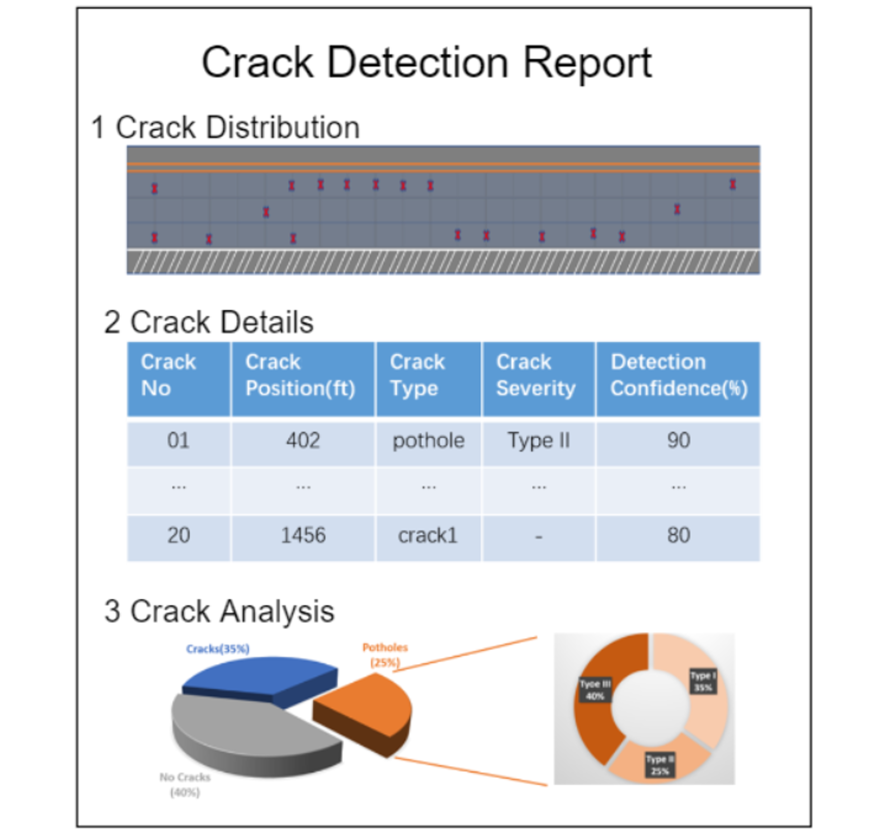
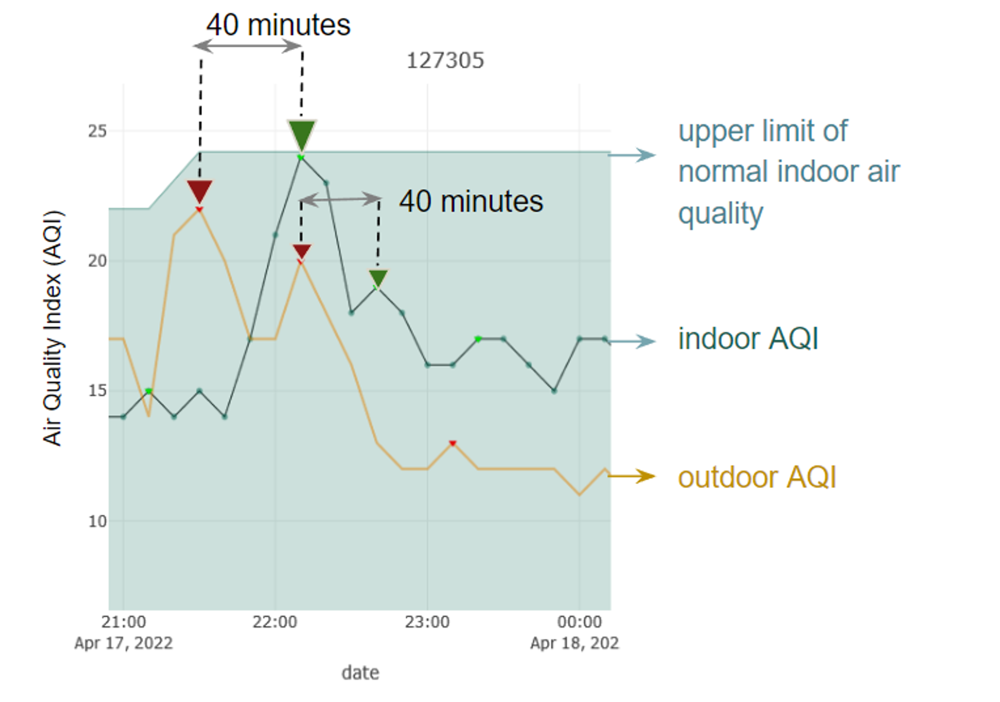

```{r setup, include=FALSE}
knitr::opts_chunk$set(echo = TRUE, warning = F, message = F)
```

```{=html}

```
## About

I am Jinpu Cao, a graduate student of the [Sustainable Design and Construction Program](https://cee.stanford.edu/academics-admission/graduate-degrees/ms-programs/sustainable-design-construction-sdc) Civil and Environmental Engineering, Stanford University (2020 - 2022). My research interests lie in applying data-driven methods and Artificial Intelligence (AI) to Architecture Engineering and Construction (AEC) to help us create smart and sustainable infrastructures and living environments.

## Education Experience

2020 - 2022 M.S. in [Sustainable Design and Construction Program](https://cee.stanford.edu/academics-admission/graduate-degrees/ms-programs/sustainable-design-construction-sdc) in Civil and Environmental Engineering Department<br> Stanford University<br>

2019 - 2020 Exchange Student in [GeoSystems Engineering Program](https://ce.berkeley.edu/programs/geo) in Civil and Environmental Engineering Department<br> University of California, Berkeley (One Year)<br>

2016 - 2020 B.E. in [Civil and Environmental Engineering](https://civileng.tongji.edu.cn/civilengen/main.htm)<br> Tongji University

## Conferences

-   Speaker in the 4th International Conference on Information Technology in Geo-Engineering (4ICITG) organized by Geotechnical Society of Singapore. Presentation: "***A Long-term Probabilistic Forecasting Approach of TBM Operating Parameters based on Deep Learning.***" (August 2022, online, <https://www.4iticg.org/4-august-2022>)

-   Speaker in the II International Geo-science Machine Learning Big Data Seminar. Presentation: "***Predicting TBM Performance using Machine Learning: is Surrounding Rock Information Important.***" (August 2019, Shanghai)

## Publications

1.  " A LSTM-based model for TBM performance prediction and the effect of rock mass grade on prediction accuracy " (China Civil Engineering Journal, first author, accepted)

2.  "PigSense: Vibration-based Activity and Health Monitoring System for Pigs" (ACM Journals, co-author, in review)

3.  "Improving adaptation to wildfire smoke and extreme heat in vulnerable communities: Evidence from a pilot study in the San Francisco Bay Area" (Environmental Research Letters, contributor, ready to submit)

## Research Projects

1.  {align="right" margin="50" width="15%"}[**Computer Vision-based Pavement Distress Detection System**](https://github.com/J-i-n-p-u/Pavement-Crack-Detection-based-on-Computer-Vision#pavement-crack-detection-based-on-computer-vision) (March 2022-Now)

    Worked as a research assistant advised by Pooja Jain (V.P. Strategic Innovation in WSP) and [Dr. Martin Fischer](https://profiles.stanford.edu/martin-fischer) (Professor at Stanford).

    This is a significant exploration of developing the practical workflow of a vision-based automatic pavement distress detection system and software kit, and I am also responsible for discovering the potential business value of the process. <br><br>

2.  **Pilot Air Quality Analysis in the Bay Area** (Mar 2022 - Now)\

    {align="right" margin="50" width="158"} Worked as a research assistant advised by [Derek Ouyang](https://derekouyang.com/) (Research Manager at the [RegLab, Stanford](https://reglab.stanford.edu/)) and [Dr. Gabrielle Wong-Parodi](https://profiles.stanford.edu/209361) (Professor at Stanford).

    This community-engaged pilot study aims to improve adaptation to wildfire smoke and extreme heat in vulnerable communities. I am responsible for characterizing these communities' air quality and exploring their human-induced and environment-induced influence on it. The team I led characterized the relationship between indoor and outdoor air quality with a spike lag model and verified it by actual monitoring data, which will be a vital contribution to our new journal paper.

3.  **PigSense: Structural Vibration-based Activity and Health Monitoring System for Pigs** (Jan 2022 - Sept 2022)\

    {align="right" margin="50" width="158"} Worked as a researcher advised by [Dr. Hae Young Noh](https://profiles.stanford.edu/hae-young-noh?releaseVersion=9.11.0) (Professor at Stanford) in Stanford [Structures as Sensors Lab](https://noh-lab.stanford.edu/)

    This project introduces the first system to track animals using structural vibrations, and the first system for automated characterization of piglets' group activities, including nursing, sleeping and active times. I have realized the classification of piglet group activities using structural vibration data on machine learning methods.

4.  **Long term probability prediction platform of urban water consumption** (Oct 2020 - Sept 2021)\

    {align="right" margin="50" width="190"} Worked as a research assistant advised by [Dr. Fang Liu](https://geotec.tongji.edu.cn/lf/main.psp) (Professor at Tongji University)

    This was a practical and valuable project to build an intelligent diagnosis, risk reasoning and decision support system for municipal facilities. I developed a water consumption probability prediction model based on a deep autoregressive model (DeepAR) independently, and the model has been partially integrated into the Shanghai Smart Intelligent Platform to predict daily water consumption and provide pipe burst early warning services.

5.  **Tunnel Boring Machine (TBM) Operation Parameters Prediction** (Jan 2019 - Sept 2019)\

    {align="right" margin="50" width="158"} Worked as a research assistant advised by [Dr. Fang Liu](https://geotec.tongji.edu.cn/lf/main.psp) (Professor at Tongji University) The project aims to predict TBM operation parameters based on its historical data, promoting safe and efficient tunneling construction of TBM. I independently developed TBM parameters and geological prediction model based on Long Short-Term Memory (LSTM) network , and won the National Third Place in the data mining competition organized by the Chinese Society of Rock Mechanics and Engineering.
